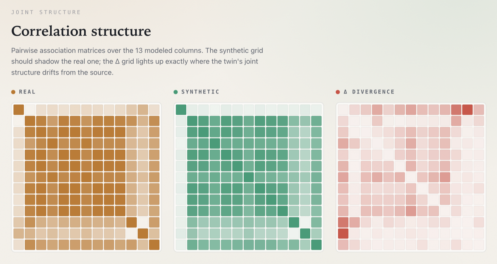

# doppel

Synthetic tabular data from real datasets.

doppel fits a source table and generates rows with similar distributions,
correlations, null patterns, unique-value counts, and foreign-key structure. Given
the same source and `--seed`, output is deterministic.

## Fidelity Benchmark

`doppel gen` then `doppel diff` on
[California Housing](https://scikit-learn.org/stable/datasets/real_world.html#california-housing-dataset)
— 20,640 rows × 9 numeric columns, ships with scikit-learn. The metrics are
seed-deterministic; reproduce them with `uv run python benchmarks/run.py`.

| Metric | Value | Reading |
|--------|-------|---------|
| Dataset | California Housing (20,640 × 9) | real public data, all numeric |
| Mean marginal KS/TVD | **0.0069** | per-column distribution distance — lower is closer |
| Correlation Frobenius distance | **0.0207** | correlation-structure distance — lower is closer |
| DCR p5 | **0.0152** | 5th-percentile distance to nearest real row — higher means less copying |
| Verbatim text rate | n/a | no text columns in this dataset to copy |
| Fit + generate | ~1.9 s | 20,640 rows, wall-clock on one laptop |
| Seed | `42` | same seed + source → identical numbers |

Full machine-readable report: [benchmarks/results/housing.json](benchmarks/results/housing.json).

`doppel diff` also ships a self-contained HTML report. Its correlation section renders the
real and synthetic association matrices side by side, with a divergence map that lights up
wherever the synthetic twin's joint structure drifts from the source:



## Install

```bash
uv sync
uv run doppel --help
```

For optional connectors and PII handling:

```bash
uv sync --extra sql
uv sync --extra pii
uv sync --all-extras
```

CLI and import name: `doppel`.

## Supported Formats

Inputs: CSV, TSV, Parquet, JSON/NDJSON, Arrow/IPC, DuckDB, Snowflake, Postgres.

Outputs: CSV, TSV, Parquet, JSON/NDJSON, Arrow/IPC, DuckDB.

## Quickstart

```bash
uv run doppel gen examples/saas_accounts.csv -n 1000 -o synth.csv \
  --seed 1 \
  --text-policy hash

uv run doppel diff examples/saas_accounts.csv synth.csv \
  --max-marginal 0.12 \
  --min-dcr-p5 0.02 \
  --fail-on-verbatim-text

uv run doppel doctor
```

Expected shape from the demo fixture:

```text
ok wrote 1000 rows x 15 cols -> synth.csv
quality | marginal=0.1005 | corr=0.1062 | dcr_p5=0.0507 | text_leaks=0
thresholds: all passed
```

Exact metric values can move slightly with dependency versions. `doppel diff` exits `2`
when a threshold is breached. See [examples/README.md](examples/README.md) for a
no-secret demo that writes the synthetic CSV, HTML report, JSON report, and inferred
schema under `/tmp/doppel-demo`.

## Generate Rows

```bash
doppel gen sales.csv -n 100000 -o synth.csv --seed 1
doppel gen big.parquet -n 100000 -o synth.parquet --fit-rows 25000 --seed 1
doppel gen customers.csv -n 10000 -o synth.csv --text-policy hash --seed 1
doppel gen sales.csv -n 5000 -o synth.csv \
  --where "plan == 'enterprise' and tenure_days > 365" \
  --seed 1
```

Common flags:

| Flag | Meaning |
|------|---------|
| `--seed N` | Controls every random choice. Same seed and source should produce the same output. |
| `--fit-rows N` | Sample source rows before fitting. `0` disables the automatic cap. SQL sources sample in the warehouse. |
| `--where EXPR` | Keep generated rows matching a boolean expression. Supports `== != < <= > >=` plus `and` / `or`. |
| `--max-oversample N` | Raise this when `--where` or constraints are rare. Default: `4`. |
| `--text-policy sample|hash|fake|drop` | Handle free-text columns. `fake` requires `[pii]`. |
| `--schema PATH` | Override types, declare keys, and add constraints. |
| `--explain` | Print per-column modeling choices after fit. |

See [docs/determinism.md](docs/determinism.md) for the seed contract.

## Programmatic usage (experimental)

Library API is not semver-frozen until v0.2. Prefer the CLI for stable workflows.

```python
from pathlib import Path

from doppel.pipeline import SingleTableGenerateConfig, generate_single_table
from doppel.sources.spec import FilePath
from doppel.text_policy import TextPolicy

result = generate_single_table(
    SingleTableGenerateConfig(
        source_spec=FilePath(path=Path("sales.parquet")),
        rows=1000,
        seed=1,
        text_policy=TextPolicy.SAMPLE,
    ),
    sample_fit=lambda df, n: df if n is None else df.head(n),
)
synth_df = result.out_df
```

`generate_single_table` mirrors `doppel gen` for single-table runs (read, fit, sample,
constraints/`where`, optional PII strip/restore, text policy). Pass `sample_fit` for
client-side fit-row sampling the way the CLI does.

## Fit Once, Sample Later

```bash
doppel fit sales.parquet -o sales.doppel --seed 1
doppel sample sales.doppel -n 1000000 -o synth.parquet --seed 1
doppel artifact info sales.doppel
```

`doppel fit` refuses sources with detected PII. Use `doppel gen` for one-shot PII
regeneration. `.doppel` artifacts contain pickled models; only load artifacts from
sources you trust.

## SQL Sources

```bash
# DuckDB
doppel gen "duckdb:///data.db" --table users -n 1000 -o synth.csv --seed 1

# Snowflake
doppel gen "snowflake://adam@account/db/schema?warehouse=WH" \
  --table USERS \
  --password-cmd "op read op://vault/snowflake/password" \
  --fit-rows 25000 \
  -n 1000 \
  -o synth.csv \
  --seed 1

# Postgres
doppel gen "postgres://adam@host/dbname" \
  --query "SELECT * FROM users WHERE plan = 'enterprise'" \
  --password-cmd "op read op://vault/postgres/password" \
  -n 1000 \
  -o synth.parquet \
  --seed 1
```

Password lookup order: `--password-cmd`, then `${ENV_VAR}` interpolation in the URI,
then a URI-embedded password. URI passwords warn because they can appear in shell history.

Snowflake and Postgres tables above 1,000,000 rows require `--fit-rows N` or
`--fit-rows 0`. SQL sinks are DuckDB only; write files for other warehouses and load
them with your normal data load process.

See [docs/sql-connectors.md](docs/sql-connectors.md) for URI formats, schema files,
and vendor-specific sampling.

## Multi-table Data

Declare tables and foreign keys in `schema.toml`:

```toml
[tables.users]
file = "data/users.parquet"
primary_key = "user_id"

[tables.orders]
file = "data/orders.parquet"
primary_key = "order_id"

[[foreign_keys]]
child_table = "orders"
child_column = "user_id"
parent_table = "users"
parent_column = "user_id"
```

```bash
doppel gen --schema schema.toml -n 1000 -o synth/ --seed 1
doppel gen --schema schema.toml -n 1000 \
  --rows-per-table users=1000,products=50 \
  -o synth/ \
  --seed 1
```

`-n` is rows per root table. Child rows are attached to generated parent keys. doppel
preserves foreign-key integrity, but it does not preserve cross-table correlations
such as "larger customers place larger orders."

## Schema Files

`schema.toml` can:

- override column types: `KEY`, `NUMERIC`, `CATEGORICAL`, `TEXT`, `BOOLEAN`,
  `DATETIME`, `DATE`
- declare primary and foreign keys
- add range, inequality, and derived constraints
- toggle datetime calendar features

Check a schema with:

```bash
doppel schema check sales.csv --schema schema.toml
```

## Quality Reports

```bash
doppel diff real.parquet synth.parquet \
  --max-marginal 0.10 \
  --min-dcr-p5 0.05 \
  --fail-on-verbatim-text \
  --json doppel-report.json \
  -o report.html
```

Metrics:

| Metric | Meaning |
|--------|---------|
| `marginal` | Average per-column KS / TVD distance. Lower is closer. |
| `corr_frobenius` | Correlation-matrix distance. Lower is closer. |
| `dcr_p5` | 5th-percentile distance to closest real record. Higher means less near-copying. |
| `verbatim_rate` | Fraction of text values copied from the source. |

Use `--sample-rows N` and `--max-dcr-rows N` for large comparisons.

## Privacy and Security

doppel is not differential privacy.

Detected PII can be regenerated with `[pii]`. Undetected free text may be copied
verbatim from the source. For identifying text columns, use
`--text-policy hash|fake|drop` and check output with `doppel diff`.

`.doppel` files use a restricted unpickler with an allowlist, but they are still model
artifacts from code. Only load files you trust. See [SECURITY.md](SECURITY.md).

## Limitations

- Multi-table correlations are not preserved.
- `--where` is scoped to one table.
- Datetime values are modeled as epoch seconds plus calendar features; sub-second
  precision is dropped.
- Warehouse writes are DuckDB only.
- `fit` refuses detected PII; use `gen` for one-shot PII handling.
- `KEY` columns synthesize sequential IDs from `1..n` (or deterministic UUID hex for
  `uuid` / `*_uuid` string keys), not a continuation of source ID ranges.
- `.json` output serialises datetimes as strings; reading that file back yields string
  columns, so `doppel diff` against JSON synth output is not meaningful. Prefer Parquet or CSV.

## Examples

- [examples/pytest_fixture/](examples/pytest_fixture/)
- [examples/dbt_seed/](examples/dbt_seed/)
- [examples/github-action/](examples/github-action/)

## Development

```bash
uv sync --all-extras
uv run ruff check src tests
uv run ruff format --check src tests
uv run pyright
uv run pytest
```

## License

MIT
